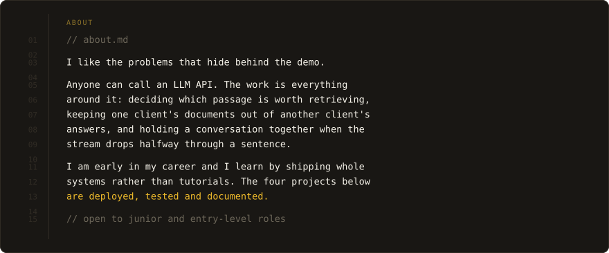
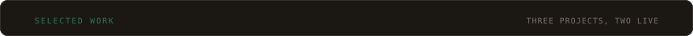
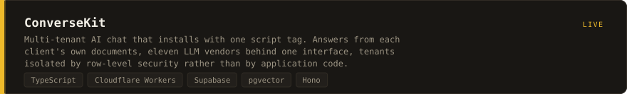
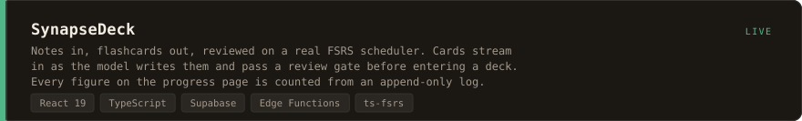
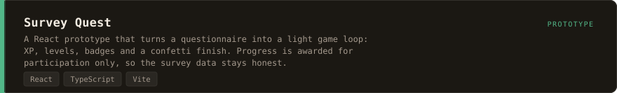
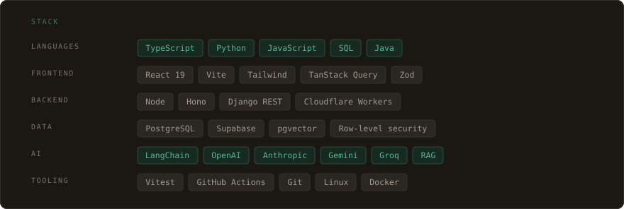
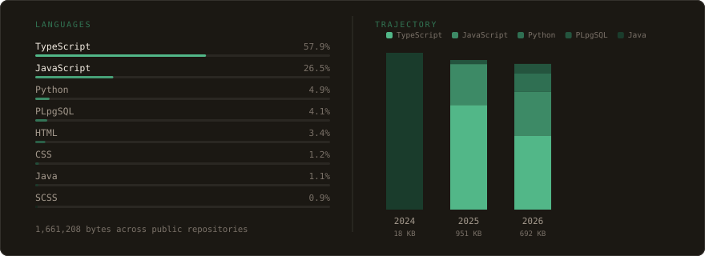

<!--
  Every section on this page is an SVG in assets/, because GitHub strips <style>
  tags and style attributes from README HTML and there is no other way to hold a
  layout together here. Regenerate them with:

      python tools/build_assets.py      # data -> section artwork

  Do not hand-edit anything in assets/: the next build overwrites it. The
  signature outlines in tools/brand.py are copied from the portfolio repo's
  generated lib/brand-marks.ts.

  Facts here come from the portfolio's content/ and must stay a subset of it.
-->

